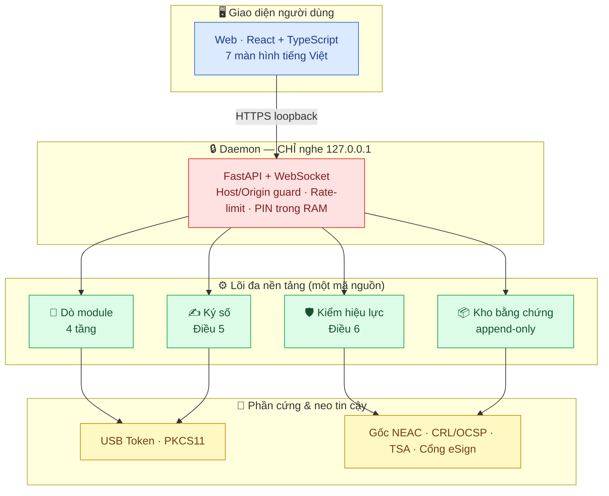
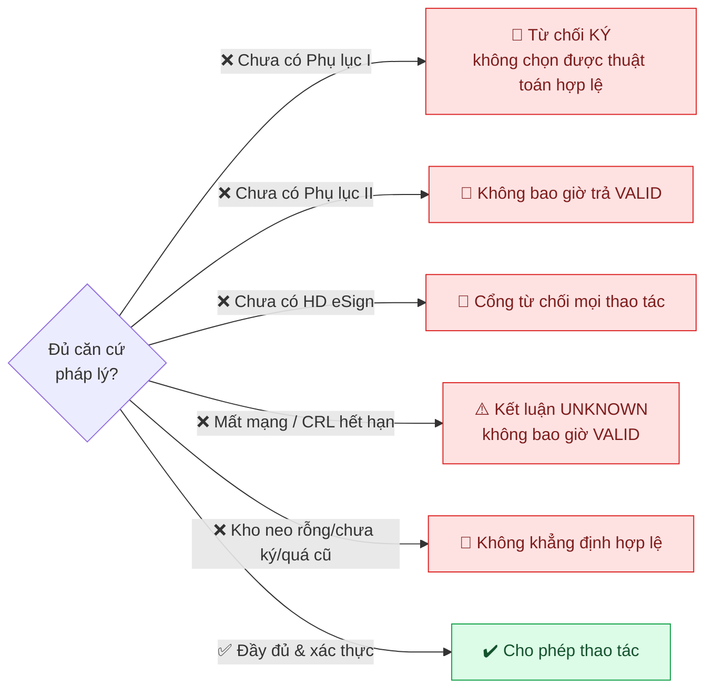
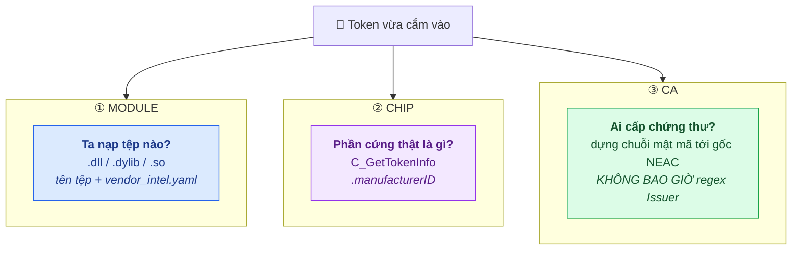
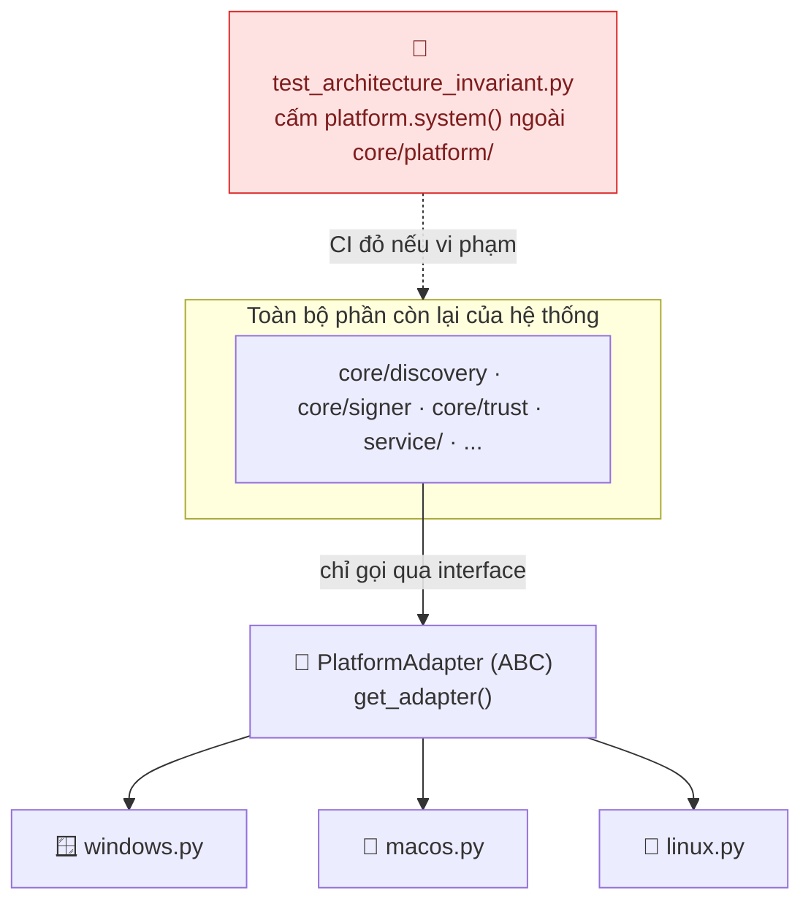
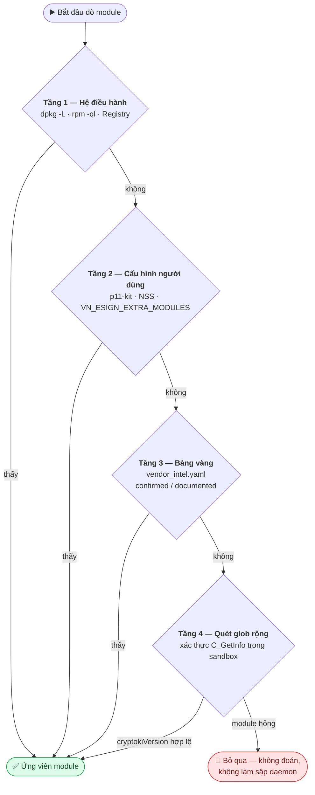
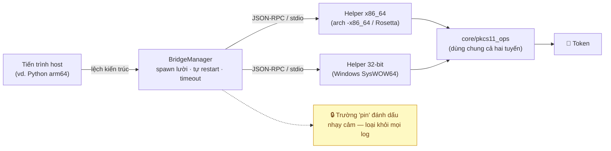
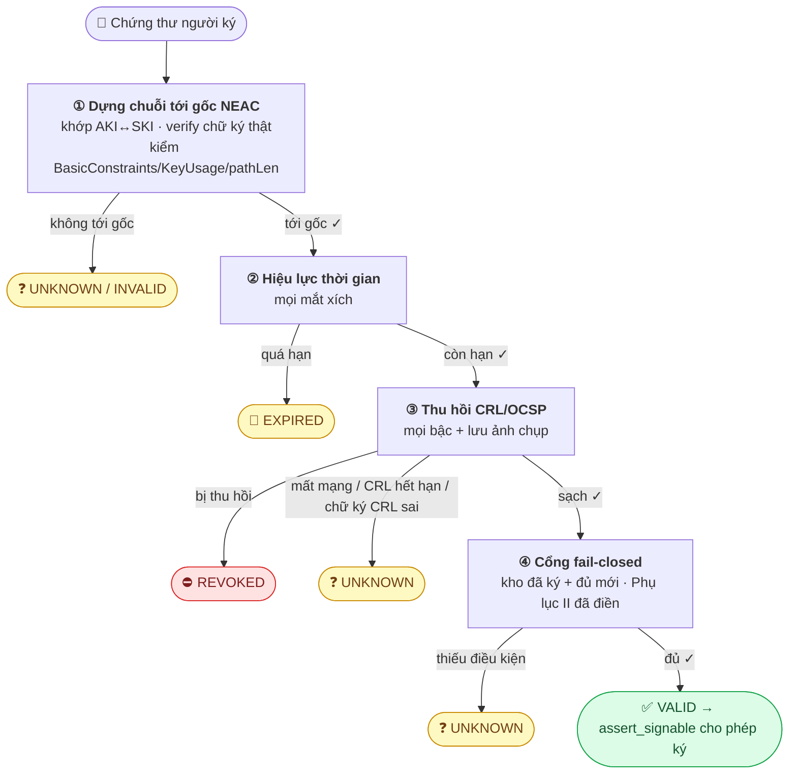
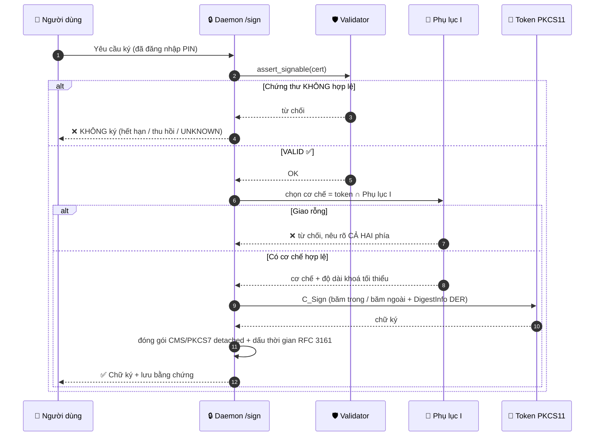
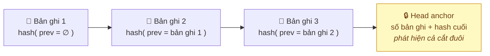
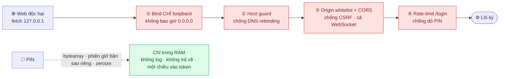

<div align="center">

# 🔐 vn-esign-suite

### Phần mềm **ký số** và **kiểm tra chữ ký số** trên USB token

*Một mã nguồn lõi duy nhất — chạy thống nhất trên Windows · macOS (Intel & Apple Silicon) · Linux*


</div>

---

> [!IMPORTANT]
> Đây là **"phần mềm ký số"** và **"phần mềm kiểm tra chữ ký số"** theo **Điều 17 Nghị định 23/2025/NĐ-CP** và **Thông tư 15/2025/TT-BKHCN**. Vì thuộc diện điều chỉnh trực tiếp của pháp luật, **phần lớn hành vi của phần mềm là yêu cầu bắt buộc chứ không phải lựa chọn kỹ thuật.** Bảng đối chiếu từng điều khoản với module và test nằm ở [`docs/compliance/`](docs/compliance/README.md).

## 🗺️ Toàn cảnh hệ thống

Từ cú cắm token đến chữ ký có giá trị pháp lý — mọi thứ chạy nội bộ trên máy người dùng, không có bước nào âm thầm ra Internet:



<table>
<tr>
<td width="33%" align="center"><b>📦 0.1.0</b><br/>Phiên bản</td>
<td width="33%" align="center"><b>🐍 Python ≥ 3.11</b><br/>Lõi</td>
<td width="34%" align="center"><b>⚖️ <a href="LICENSE">MIT</a></b><br/>Giấy phép</td>
</tr>
<tr>
<td align="center"><b>✅ 238 test</b><br/>4 nền tảng · SoftHSM2</td>
<td align="center"><b>🔒 127.0.0.1</b><br/>Ranh giới tin cậy</td>
<td align="center"><b>🧩 58 module</b><br/>Lõi Python</td>
</tr>
</table>

---

## 📑 Mục lục

| # | Chương | # | Chương |
|:-:|---|:-:|---|
| 1 | 🏛️ [Bối cảnh pháp lý & fail-closed](#1-bối-cảnh-pháp-lý-và-triết-lý-fail-closed) | 7 | 🗂️ [Tệp dữ liệu và cấu hình](#7-tệp-dữ-liệu-và-cấu-hình) |
| 2 | 🧭 [Nguyên lý kiến trúc](#2-nguyên-lý-kiến-trúc) | 8 | ⏳ [Điều kiện pháp lý đang chờ](#8-điều-kiện-tiên-quyết-pháp-lý-đang-chờ) |
| 3 | 🔄 [Luồng nghiệp vụ](#3-luồng-nghiệp-vụ) | 9 | 🚀 [Bắt đầu, build & triển khai](#9-bắt-đầu-build-và-triển-khai) |
| 4 | 🛡️ [Daemon và mô hình bảo mật](#4-daemon-và-mô-hình-bảo-mật) | 10 | 🧪 [Kiểm thử](#10-kiểm-thử) |
| 5 | 🖥️ [Giao diện web](#5-giao-diện-web) | 11 | 📋 [Trạng thái tuân thủ](#11-trạng-thái-tuân-thủ) |
| 6 | 📁 [Cấu trúc kho mã](#6-cấu-trúc-kho-mã) | | |

---

## 1. Bối cảnh pháp lý và triết lý fail-closed

### 📜 Căn cứ

| Văn bản | Nội dung liên quan |
|---|---|
| **NĐ 23/2025/NĐ-CP**, Điều 17 | Định nghĩa và chức năng bắt buộc của phần mềm ký số / kiểm tra chữ ký số |
| **TT 15/2025/TT-BKHCN**, Điều 5 | Chức năng phần mềm ký số: trình tự ký, lưu trữ bằng chứng, hiển thị, thông báo tiếng Việt |
| **TT 15/2025/TT-BKHCN**, Điều 6 | Kiểm tra hiệu lực qua đường dẫn tin cậy tới gốc NEAC, kiểm thu hồi |
| **TT 15/2025/TT-BKHCN**, Điều 7–8 | Kết nối Cổng eSign công cộng theo Hướng dẫn kỹ thuật của Bộ KH&CN |
| **TT 15/2025**, Phụ lục I / II | Tiêu chuẩn kỹ thuật (thuật toán, khoá, định dạng) / tiêu chí hợp lệ chứng thư |
| **TT 19/2025/TT-BKHCN** | Hậu kiểm kỹ thuật định kỳ (hiệu lực 1/1/2026) |
| **QCVN 138:2025/BKHCN** | Dấu thời gian (TSA) |

### 🚦 Fail-closed là mặc định

> [!WARNING]
> Ba nhóm tham số bắt buộc lấy từ văn bản chính thức và **KHÔNG được suy đoán**: Phụ lục I, Phụ lục II, và Hướng dẫn kỹ thuật kết nối Cổng eSign. Khi bất kỳ nhóm nào chưa được điền, hệ thống **từ chối hoạt động thay vì đoán.**



Nguyên tắc này là **cố ý**: một kết luận "hợp lệ" sai hoặc một chữ ký sai chuẩn gây hậu quả pháp lý nặng hơn nhiều so với việc từ chối và yêu cầu bổ sung cấu hình.

---

## 2. Nguyên lý kiến trúc

### 2.1 🎯 Ba trục độc lập — không suy trục này ra trục kia

Nguồn lỗi phổ biến nhất khi làm việc với token của các CA Việt Nam là **trộn lẫn ba khái niệm khác nhau**. Hệ thống tách bạch chúng triệt để:



| Trục | Câu hỏi | Cách xác định | Module |
|------|---------|---------------|--------|
| **① Module** | Ta nạp tệp `.dll`/`.dylib`/`.so` nào? | tên tệp, `data/vendor_intel.yaml` | `core/platform`, `core/discovery`, `core/bridge` |
| **② Chip** | Phần cứng thật trong token là gì? | `C_GetTokenInfo().manufacturerID` | `core/pkcs11_ops`, `core/pkcs11_engine` |
| **③ CA** | Ai cấp chứng thư? | dựng chuỗi chứng thư tới gốc NEAC | `core/trust` |

> [!CAUTION]
> Việc nhận diện CA **chỉ** dựa trên chain building bằng mật mã, **tuyệt đối không dùng regex** trên chuỗi Issuer. Danh sách 26 CA công cộng biến động theo thời gian và nhiều đơn vị có tên gần giống nhau — *CA2, I-CA, SmartSign là ba tổ chức khác nhau; Nacencomm vận hành CA2 chứ không phải I-CA.* So khớp chuỗi vừa sai về nguyên tắc vừa không có giá trị pháp lý. Kết luận này được khoá bằng test hồi quy (`tests/test_regression_matrix.py`).

### 2.2 🧱 Cô lập hệ điều hành (bất biến kiến trúc)

Toàn bộ tri thức phụ thuộc OS nằm trong **một thư mục duy nhất** — `core/platform/`. Mọi module khác làm việc qua interface trừu tượng `PlatformAdapter` và factory `get_adapter()`.



`PlatformAdapter` khai báo hợp đồng gồm: nhận diện nền tảng (`name`, `host_arch` kèm cờ Rosetta), định vị module (`library_search_paths`, `glob_patterns`, `discover_from_system`, `discover_from_user_config`), phân tích kiến trúc native (`check_binary_arch` đọc header PE/Mach-O/ELF, `needs_arch_bridge`, `spawn_bridge_helper`), backend thẻ (`pcsc_backend_ready`), dự phòng chứng thư (`certstore_fallback`), và thư mục chuẩn (`config_dir`, `log_dir`, `service_install_hint`).

| Khía cạnh | 🪟 Windows | 🍎 macOS | 🐧 Linux |
|---|---|---|---|
| **Đuôi module** | `.dll` | `.dylib` (OpenSC `.so`) | `.so`, `.so.*` |
| **Khám phá hệ thống** | Registry (Uninstall, Crypto Providers) | `system_profiler`, CryptoTokenKit | `p11-kit`, dpkg/rpm |
| **Header native** | PE (COFF machine) | Mach-O / fat (lipo) | ELF (`e_machine`) |
| **Lệch kiến trúc điển hình** | 64 ↔ 32-bit (SysWOW64) | arm64 ↔ x86_64 (Rosetta 2) | arm64 ↔ x86_64 |
| **Backend PC/SC** | WinSCard (SCardSvr) | CryptoTokenKit | pcscd |
| **Dự phòng chứng thư** | CertStore "MY" (crypt32) | login + System Keychain | NSS DB (`~/.pki/nssdb`) |
| **Chạy nền** | Windows Service / Task Scheduler | LaunchAgent | systemd `--user` |
| **`config_dir`** | `%APPDATA%` | `~/Library/Application Support` | `$XDG_CONFIG_HOME` |

---

## 3. Luồng nghiệp vụ

### 3.1 🔎 Phát hiện module PKCS#11 — "hỏi hệ điều hành, đừng đoán tên tệp"

`core/discovery.py` chạy **bốn tầng theo thứ tự ưu tiên**, dừng ngay khi có ứng viên đáng tin:



Module chia hai nhánh: **Track A** đặt tên theo chip (`eTPKCS11.dll`, `opensc-pkcs11.so`, `libcastle.so`…) và **Track B** do CA đóng gói lại (`fptca_v4.so` từ gói `fptca-4.0`). Hệ thống chỉ dò Track A **sẽ không bao giờ tìm ra FPT-CA trên Linux** — đó là lý do Track B tồn tại. Kiến trúc lệch chỉ được **đánh cờ** `needs_arch_bridge` chứ không loại bỏ ứng viên.

### 3.2 🌉 Cầu nối kiến trúc

Nhiều middleware chỉ phát hành cho một kiến trúc. Khi module lệch kiến trúc với tiến trình host, `core/bridge/` spawn một helper cùng kiến trúc và trao đổi qua **JSON-RPC trên stdio**:



Tầng trên gọi thống nhất qua `ModuleSession` và nhận kết quả **giống hệt** dù chạy in-process hay qua cầu nối, vì cả hai tuyến đều chạy chung `core/pkcs11_ops`.

### 3.3 📇 Đọc token và chứng thư

`core/cert_reader.py` đọc chứng thư theo hai bước: **tìm không đăng nhập trước**, nếu rỗng (chứng thư ở dạng private) thì đăng nhập bằng PIN rồi tìm lại; hỗ trợ cả đường xác thực bảo vệ (pinpad). PIN được xử lý dưới dạng `bytearray` và **ghi đè 0** sau khi dùng.

`core/aggregator.py` gộp chứng thư từ **mọi nguồn** (PKCS#11, bridge, p11-kit, gói CA rebrand, và kho dự phòng của OS), khử trùng lặp theo vân tay SHA-256, ưu tiên bản có khoá private, rồi làm giàu mỗi chứng thư bằng kết quả kiểm hiệu lực và thông tin CA lấy từ chuỗi. Chứng thư đọc từ kho OS được đánh dấu rõ `from_token=false`.

### 3.4 🛡️ Kiểm tra hiệu lực (Điều 6) — module trọng tâm pháp lý

`core/trust/validator.py` chạy một chuỗi cổng, và **bất kỳ nghi ngờ nào cũng kéo kết luận khỏi VALID**:



Kết quả là `ValidationResult` với trạng thái `VALID` / `INVALID` / `EXPIRED` / `REVOKED` / `UNKNOWN` / `FOREIGN_RECOGNIZED`, kèm đường dẫn tin cậy, bằng chứng thu hồi từng bậc, và lý do bằng tiếng Việt — **bản thân nó là bằng chứng pháp lý lưu được.** `assert_signable()` là cổng cho phép ký: chỉ thông khi trạng thái đúng bằng `VALID`.

### 3.5 ✍️ Ký số (Điều 5 — trình tự KHÔNG được đảo)

`core/signer.py` tuân thủ đúng trình tự luật định: **kiểm hợp lệ TRƯỚC, chạm token SAU.**



Mọi tham số mật mã đọc từ `appendix_I.yaml` **lúc chạy**; bảng dịch trong code chỉ là tri thức chuẩn (PKCS#11 ↔ OID ↔ DigestInfo), không phải lựa chọn pháp lý. PAdES và XAdES giữ trạng thái fail-closed cho tới khi có thư viện và profile cụ thể trong Phụ lục I.

### 3.6 🔍 Kiểm tra chữ ký

`core/signature_verify.py` xác minh chữ ký tách rời bằng khoá công khai trong chứng thư, hỗ trợ **RSA (PKCS#1 v1.5 và PSS), ECDSA, Ed25519/Ed448** — fail-closed: mọi lỗi hoặc loại khoá lạ đều trả `False` kèm lý do tiếng Việt.

### 3.7 📦 Lưu bằng chứng và nhật ký kiểm toán (Điều 5, TT 19/2025)

`core/evidence.py` lưu, **tại thời điểm ký**, chứng thư người ký cùng chuỗi CA, ảnh chụp CRL/OCSP, và `ValidationResult` đầy đủ. Kho là **append-only có chuỗi băm** — sửa một bản ghi cũ là làm gãy toàn chuỗi:



`verify_evidence_chain()` kiểm cả chuỗi ledger lẫn vân tay từng khối dữ liệu. **Không lưu PIN hay khoá private**; nếu thiếu CRL/OCSP thì ghi rõ `revocation_captured=false` thay vì giả vờ đã có. Xoá phải có chủ đích (operator + lý do), tôn trọng chính sách lưu giữ, giữ lại dòng ledger và thêm tombstone, và được ghi audit. `export_evidence()` xuất **gói ZIP** để nộp khi tranh chấp/kiểm toán. Một `AuditLog` riêng (cũng có chuỗi băm) ghi các thao tác ký/kiểm tra/đồng bộ kho/đổi cấu hình: *ai, khi nào, kết quả.*

### 3.8 🌐 Kết nối Cổng eSign (Điều 7–8 — đang chờ văn bản)

`core/esign/` cung cấp interface `EsignGateway` (`register`, `submit_signature`, `query_status`, `health`). Vì Hướng dẫn kỹ thuật của Bộ KH&CN quy định giao thức, endpoint, định dạng bản tin và cơ chế xác thực **nhưng chưa có**, mặc định `make_gateway()` trả `NullEsignGateway` — **từ chối mọi thao tác**.

Phần hạ tầng truyền tải an toàn viết trước đã hoàn thiện và có test: allowlist domain, bắt buộc HTTPS + xác minh TLS, retry/backoff, circuit breaker, và audit không lộ dữ liệu nhạy cảm. Hệ thống **không tuyên bố tuân thủ Điều 7/8** cho tới khi spec được điền.

---

## 4. Daemon và mô hình bảo mật

`service/` là một daemon FastAPI, khởi động bằng `python -m service.app`.

### 🔌 API

| Phương thức | Đường dẫn | Chức năng |
|:---:|---|---|
| `GET` | `/health` | Trạng thái daemon, nền tảng, độ mới kho tin cậy |
| `GET` | `/diagnose` | Chẩn đoán theo OS + hướng dẫn khắc phục tiếng Việt |
| `GET` | `/tokens` | Token + chứng thư (thử không PIN) kèm hiệu lực và CA |
| `GET` | `/tokens/{id}/certs` | Chứng thư trên một token (dùng phiên PIN nếu có) |
| `POST` | `/login` | Đăng nhập PIN → phiên RAM có thời hạn |
| `POST` | `/logout` | Đăng xuất, ghi đè PIN |
| `POST` | `/validate` | Kiểm hiệu lực chứng thư + (tuỳ chọn) chữ ký tách rời |
| `POST` | `/sign` | Ký số (chỉ khi có phiên hợp lệ; gate Điều 5) |
| `WS` | `/events` | Sự kiện cắm/rút token thời gian thực |

Tài liệu OpenAPI tại `/docs`. Các route `/api/*` cũ được giữ để tương thích ngược.

### 🎯 Mô hình mối đe doạ và biện pháp

Mối đe doạ chính với một daemon nghe trên máy người dùng: **một trang web độc hại trong trình duyệt** gọi tới `http://127.0.0.1` để dò token hoặc lừa ký. Bốn lớp chặn xếp chồng:



- **🔒 Chỉ loopback:** daemon bind `127.0.0.1`, không bao giờ `0.0.0.0`.
- **🛡️ Chống DNS rebinding:** kiểm Host header, chỉ chấp nhận `127.0.0.1`/`localhost`/`::1`.
- **🚫 Chống CSRF:** kiểm Origin theo whitelist + CORS; áp dụng cả trên WebSocket.
- **🔑 PIN:** chỉ tồn tại trong RAM dưới dạng `bytearray` (kho phiên giữ bản sao riêng), thời hạn ngắn, ghi đè 0 khi logout/hết hạn/tắt daemon; không endpoint nào trả PIN hay khoá private; PIN đi một chiều vào token.
- **⏱️ Chống dò PIN:** `/login` bị giới hạn tần suất theo token.
- **📝 Nhật ký:** xoay vòng, có bộ lọc che PIN, chỉ ghi vân tay chứ không ghi DER đầy đủ.
- **⛔ Không tự cài đặt:** daemon **tuyệt đối không** tự tải hay chạy trình cài đặt bên thứ ba — chỉ phát hiện và hướng dẫn.

---

## 5. Giao diện web

`web/` là ứng dụng **React + TypeScript + Vite**, toàn bộ giao diện bằng tiếng Việt theo Điều 5, dùng react-query cho dữ liệu và một WebSocket tự kết nối lại cho sự kiện token.

| # | Màn hình | Điểm nhấn |
|:-:|---|---|
| 1 | 📋 **Danh sách token** | thời gian thực, hiển thị tách bạch **ba trục** |
| 2 | 📄 **Chi tiết chứng thư** | trạng thái hiệu lực nổi bật nhất, đường dẫn tin cậy trực quan, cảnh báo khi độ tin cậy trích xuất định danh thấp |
| 3 | 🔑 **Nhập PIN** | che, không autocomplete, cảnh báo đỏ khi sắp khoá, chặn khi đã khoá |
| 4 | ✍️ **Ký tài liệu** | nút ký **vô hiệu hoá trừ khi trạng thái đúng bằng `valid`**, kèm giải thích lý do |
| 5 | 🔍 **Kiểm tra chữ ký** | xác minh chữ ký tách rời |
| 6 | 🩺 **Chẩn đoán theo OS** | có nút sao chép nội dung udev rule |
| 7 | 🛡️ **Trạng thái kho tin cậy** | cảnh báo nổi bật khi quá cũ |

---

## 6. Cấu trúc kho mã

```
core/
  platform/       interface OS + adapter windows/macos/linux (nơi DUY NHẤT chứa tri thức OS)
    base.py         PlatformAdapter (ABC) + parse header PE/Mach-O/ELF
    windows.py macos.py linux.py
  discovery.py    phát hiện module 4 tầng
  intel.py        nạp bảng vàng vendor_intel (validate schema + index)
  bridge/         cầu nối kiến trúc JSON-RPC (client, helper, manager, router, protocol)
  pkcs11_ops.py   thao tác PKCS#11 mức thấp, dùng chung in-process và bridge
  pkcs11_engine.py, pkcs11_probe.py, pcsc_probe.py   liệt kê token, ATR
  cert_reader.py, aggregator.py   đọc chứng thư (an toàn PIN) và gộp đa nguồn
  x509_parser.py  parse DER -> CertInfo (không bao giờ raise)
  trust/          ★ TRỌNG TÂM PHÁP LÝ
    store.py        kho neo tin cậy đã ký (chống sửa), find_issuer theo AKI/SKI
    anchors.py, chain.py   chain building bằng mật mã
    revocation.py   CRL/OCSP + ảnh chụp bằng chứng
    policy.py       Phụ lục I/II + guard fail-safe
    validator.py    -> ValidationResult (bằng chứng pháp lý)
    signing.py      ký kho Ed25519
  signer.py         ký số (chọn cơ chế theo Phụ lục I, CMS, dấu thời gian)
  signature_verify.py   kiểm chữ ký tách rời
  evidence.py       lưu bằng chứng append-only + nhật ký kiểm toán
  esign/            kết nối Cổng eSign (khung + hạ tầng gia cố; chờ hướng dẫn)
  models.py, errors.py, engine.py, config.py   mô hình chung, lỗi, facade, cấu hình
service/            daemon FastAPI (app, security, sessions, deps, runtime, api/gateway)
web/                giao diện React + TypeScript + Vite
tools/              chẩn đoán, đồng bộ kho tin cậy, thu thập intel thực địa, soi module
packaging/          đóng gói + đóng dấu chữ ký cho Windows/macOS/Linux + secure_fetch
data/               kho tin cậy, bảng vendor_intel, dữ liệu tuân thủ
docs/compliance/    đối chiếu điều khoản, DPIA, ma trận kiểm thử
tests/              238 test (pytest)
```

Phụ thuộc lõi: **PyKCS11, pyscard, cryptography, asn1crypto, PyYAML, FastAPI, uvicorn, httpx** (pin phiên bản chính xác trong `requirements.txt`).

---

## 7. Tệp dữ liệu và cấu hình

> [!TIP]
> Kiến trúc chịu được thay đổi chính sách **mà không sửa code** — chỉ cập nhật dữ liệu.

| Tệp | Vai trò |
|---|---|
| `data/vendor_intel.yaml` | Bảng vàng Track A/B, tách khỏi code, có mức tin cậy |
| `data/trust_store/` | Chứng thư NEAC + các CA công cộng + danh sách nước ngoài (đã ký) |
| `data/trust_store/ca_registry.yaml` | Danh sách 26 CA công cộng làm mốc đối soát khi đồng bộ |
| `data/trust_signing_pub.pem` | Khoá công khai ghim sẵn để verify kho tin cậy |
| `data/compliance/appendix_I.yaml` | Tiêu chuẩn kỹ thuật (chưa điền → **không ký được**) |
| `data/compliance/appendix_II.yaml` | Tiêu chí hợp lệ chứng thư (chưa điền → **không trả VALID**) |
| `data/compliance/esign_gateway_spec.yaml` | Spec kết nối Cổng eSign (chưa điền → **không kết nối**) |

Người vận hành có thể nạp thêm module qua `VN_ESIGN_EXTRA_MODULES` hoặc `<config_dir>/extra_modules.txt`, và ghi đè bảng vàng qua `VN_TOKEN_INTEL_FILE`.

---

## 8. Điều kiện tiên quyết pháp lý đang chờ

| Hạng mục | Tệp | Chức năng bị chặn | Nguồn |
|---|---|---|---|
| **Phụ lục I** | `data/compliance/appendix_I.yaml` | chọn cơ chế ký, định dạng, dấu thời gian | bản gốc TT 15/2025 |
| **Phụ lục II** | `data/compliance/appendix_II.yaml` | kiểm hợp lệ chặt (trả VALID) | bản gốc TT 15/2025 |
| **HD kỹ thuật Cổng eSign** | `data/compliance/esign_gateway_spec.yaml` | kết nối Cổng (Điều 7/8) | NEAC / Bộ KH&CN |
| **Danh sách TSA** | (từ rootca.gov.vn) | gắn dấu thời gian | NEAC |
| **Kho neo tin cậy NEAC** | `data/trust_store/` | mọi kiểm tra hiệu lực | rootca.gov.vn (đồng bộ + ký) |

Lấy Phụ lục I/II từ bản gốc thông tư; Hướng dẫn kỹ thuật, danh sách TSA và chứng thư gốc từ **NEAC** (Trung tâm Chứng thực điện tử quốc gia, Bộ KH&CN, 115 Trần Duy Hưng, Hà Nội — rootca.gov.vn). Sau khi điền, đặt `status: filled` trong các tệp YAML tương ứng.

---

## 9. Bắt đầu, build và triển khai

### 💻 Phát triển

```bash
python -m venv .venv && source .venv/bin/activate
pip install -r requirements.txt -r requirements-dev.txt

python -m core.platform --diagnose        # chẩn đoán OS/arch/module/PC-SC
python -m core.discovery --scan --verbose # quét module 4 tầng
python -m service.app                      # daemon http://127.0.0.1:8787
cd web && npm install && npm run dev       # giao diện http://localhost:5173

pytest                                     # bộ test đầy đủ
ruff check core service tools tests        # lint
```

### 📦 Đóng gói theo OS

Chi tiết đầy đủ trong `packaging/README.md`. Điểm chung: trình cài đặt của dự án **an toàn theo thiết kế** — chỉ HTTPS, verify checksum/chữ ký trước khi dùng, `mktemp -d`, `chmod 700/600` (không bao giờ `777`), `set -euo pipefail`; và **đóng gói sẵn kho neo tin cậy đã ký** để máy mới không phải ra mạng mới có gốc tin cậy.

<table>
<tr><td>🪟</td><td><b>Windows</b></td><td>PyInstaller cho daemon 64-bit và helper cầu nối 32-bit; ký Authenticode cả hai tệp (tránh SmartScreen); trình cài Inno Setup; chạy nền bằng Windows Service hoặc Task Scheduler at-logon.</td></tr>
<tr><td>🍎</td><td><b>macOS</b></td><td><code>.app</code> universal2 + helper x86_64; ký hardened runtime kèm entitlement <code>disable-library-validation</code> (thiếu nó sẽ không nạp được middleware của CA — lỗi khó đoán nhất trên macOS); notarize + staple; LaunchAgent (không LaunchDaemon, vì cần phiên đăng nhập của user mới thấy token).</td></tr>
<tr><td>🐧</td><td><b>Linux</b></td><td><code>.deb</code>/<code>.rpm</code> (fpm) + AppImage; maintainer script bật pcscd, cài udev rule, nhắc thêm user vào nhóm plugdev; chạy nền bằng systemd <code>--user</code>.</td></tr>
</table>

CI (`.github/workflows/build.yml`) chạy trên `windows-latest`, `macos-14` (arm64), `macos-13` (x86_64), `ubuntu-latest`.

---

## 10. Kiểm thử

Toàn bộ **238 test** chạy được trong CI **không cần phần cứng** — SoftHSM2 đảm nhiệm token ảo cho trọn luồng ký. Ma trận đầy đủ (Track × chip × OS × kiến trúc × PIN × trạng thái chứng thư × CA) ở `docs/compliance/test_matrix.md`.

Một số **test hồi quy khoá lại các quyết định cốt lõi** và sẽ đỏ nếu bị phá vỡ:

- ✅ bảng vàng chỉ Track A không nhận ra FPT-CA;
- ✅ regex `nacencomm → I-CA` là **sai**;
- ✅ mất mạng khi kiểm thu hồi trả `UNKNOWN` chứ không `VALID`;
- ✅ chứng thư hết hạn / bị thu hồi bị **từ chối ký**;
- ✅ chèn chứng thư lạ vào kho đã ký làm kho **mất hiệu lực**;
- ✅ cert giả mạo chép Subject DN của neo nước ngoài **không được công nhận**.

---

## 11. Trạng thái tuân thủ

**Đã hiện thực và có test** ✅ — cô lập OS, phát hiện module, cầu nối kiến trúc, đọc token và chứng thư, chain building, CRL/OCSP, kiểm hiệu lực, ký số CMS với cổng kiểm hợp lệ trước khi ký, kiểm chữ ký, lưu bằng chứng append-only và nhật ký kiểm toán, daemon loopback có gia cố bảo mật, giao diện web, và đóng gói ba OS.

**Chờ văn bản chính thức** ⏳ (giữ trạng thái fail-closed đến khi được điền) — Phụ lục I, Phụ lục II, Hướng dẫn kỹ thuật Cổng eSign, danh sách TSA, và nạp chứng thư NEAC cùng các CA công cộng vào kho tin cậy.

> [!NOTE]
> Bảng đối chiếu chi tiết từng khoản Điều 5/6/7/8 TT 15/2025 và Điều 17 NĐ 23/2025 với module và test — kèm trạng thái *đáp ứng / một phần / chưa / chờ văn bản* — nằm ở [`docs/compliance/README.md`](docs/compliance/README.md). **Việc trung thực về trạng thái tuân thủ được ưu tiên hơn một báo cáo đẹp**, vì hồ sơ sẽ bị đối chiếu khi hậu kiểm kỹ thuật theo TT 19/2025.

---

## ⚖️ Giấy phép

Phát hành theo giấy phép [**MIT**](LICENSE).

<div align="center">
<sub>Xây dựng theo triết lý <b>fail-closed</b> — thà từ chối còn hơn đoán sai. · Điều 17 NĐ 23/2025/NĐ-CP · TT 15/2025/TT-BKHCN</sub>
</div>
